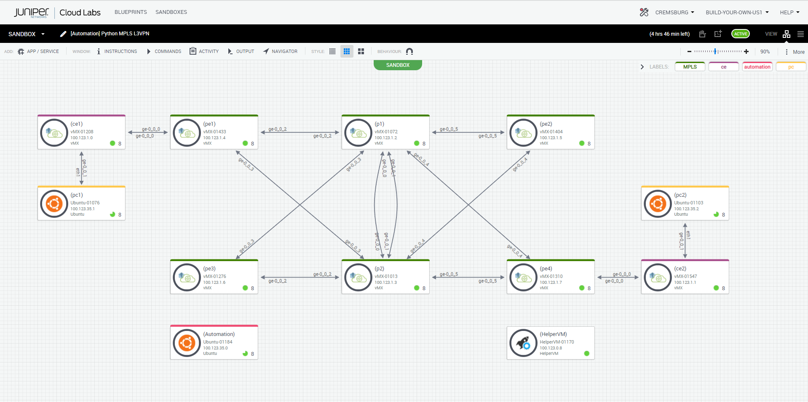

# Juniper MPLS L3VPN demo

Welcome to the repository that manages the demonstration of using PyEZ to build, validate, and deploy an MPLS network on Juniper vMX routers. In addition to the MPLS network, we will have a working L3VPN circuit delivered over MP-BGP.

It is my hope that this repository helps those looking to understand more about MPLS or how Python applies to the networking world.

---

## Documentation Site

For all information about this project, please reference the [documentation page](https://cdot65.github.io/juniper-mpls-l3vpn-demo/).

---

## Virtualization

We are leveraging Juniper vLabs to deploy the virtualized lab, but we have also included an EVE-NG topology to import if you do not have access to vLabs.

_high-level design_

_Juniper vLabs_

_EVE-NG_

