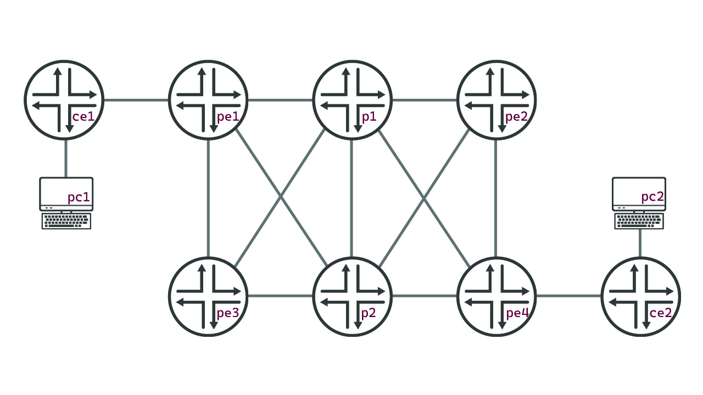

# Juniper MPLS L3VPN demo

Welcome to the repository that manages the [documentation](https://cdot65.github.io/juniper-mpls-l3vpn-demo/) for my MPLS L3VPN demo. In this demonstration, we will deploy a L3VPN circuit across an MPLS backbone with Python and Juniper vMX routers

## Documentation Site

For all information about this project, please reference the [documentation page](https://cdot65.github.io/juniper-mpls-l3vpn-demo/).

## Topology Used

We are leveraging EVE-NG to deploy an MPLS network on Juniper vMX routers.

