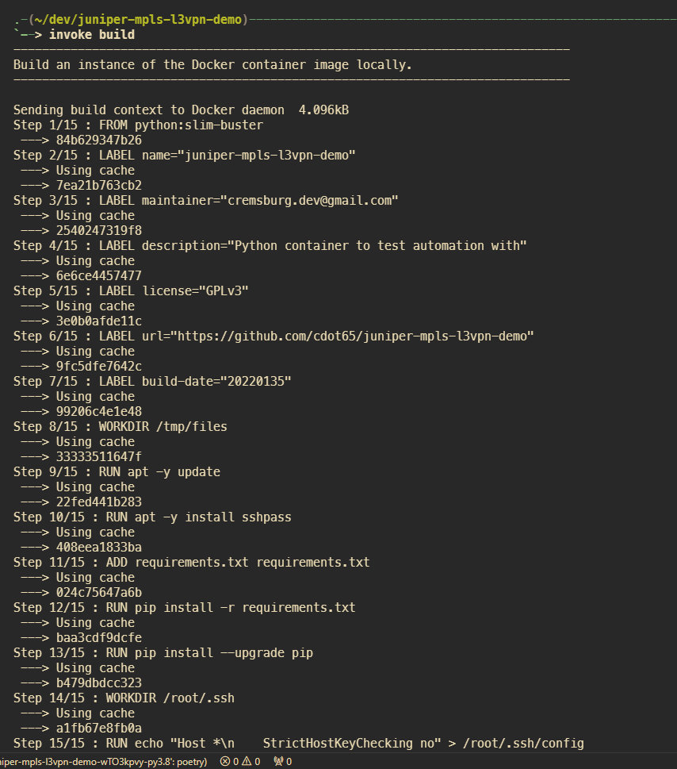
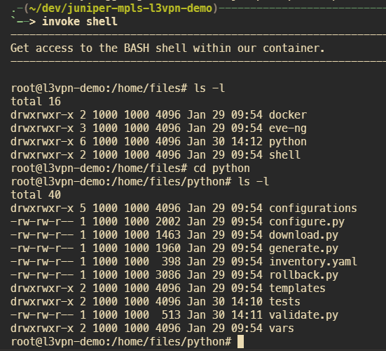

## Dockerfile

A Dockerfile has also been provided for those that would like to execute this within an isolated container instead of a virtual environment.

---

### 🚀 Building the Docker container image

The workflow will depend on whether or not you're taking advantage of Invoke.

#### Without Invoke

Build the container image locally requires just a single command, make sure to update the name of your image from `xyz` to whatever works for your team.

```bash
docker build -t xyz:latest files/docker/
```

#### With Invoke

For those that created a virtual environment with Poetry, we have provided a couple of additional Invoke tasks below to help with building and accessing the Docker container environment.

| Command        | Action                                                   |
| -------------- | -------------------------------------------------------- |
| `invoke build` | Build an instance of the Docker container image locally. |

FWIW, all tasks within Invoke's `tasks.py` file are tied to Docker containers.

---

### 🚀 Building the Docker container image

The workflow will depend on whether or not you're taking advantage of Invoke.

### With Invoke

| Command        | Action                                             |
| -------------- | -------------------------------------------------- |
| `invoke shell` | Get access to the BASH shell within our container. |

1. Have Poetry install your Python packages in a virtual environment (one-time operation)
2. Activate your new virtual environment with Poetry
3. Build Docker container image (one-time operation)
4. Run locally or within a container using the Invoke package

```bash
invoke shell
```




