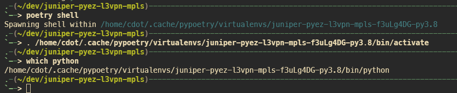

## 📌 Overview

A [Poetry](https://python-poetry.org/docs/) lock file to help you create a Python environment that mirrors my own. As long as you [have Poetry installed on your machine](https://python-poetry.org/docs/), to you can simply type `poetry install` to create the virtual environment, followed by `poetry shell` to activate it.

---

## 🚀 Workflow

The workflow will look like this:

1. Have Poetry install your Python packages in a virtual environment (one-time operation)
2. Activate your new virtual environment with Poetry
3. Validate the Python packages installed

```bash
poetry install
poetry shell
pip freeze
```



